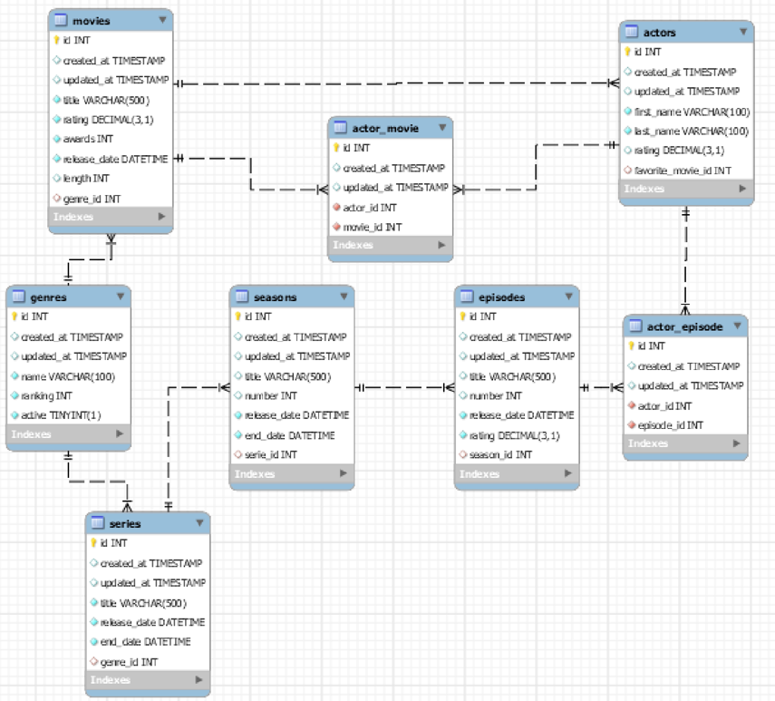

## Cascading e Fetch Type

> Prática integradora

### Objetivo

O objetivo deste exercício é que possamos consolidar e aprofundar os conceitos relacionados à cascata usando Spring Data
Jpa.

## Movies DB

Selecione 4 entidades relacionadas do banco de dados movies_db e programe o CRUD dessas entidades.

a. Defina, implemente e verifique se as tarefas em cascata são executadas corretamente.

b. Defina, implemente e verifique as configurações Lazy e Eager nas tabelas selecionadas.

