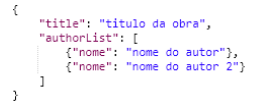
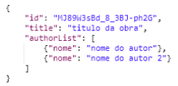

## Atividade N° 1

> Controlador REST para Elasticsearch

## Objetivo
O objetivo deste exercício é entender como usar o Spring Data Elasticsearch em um projeto
Spring e definir nosso primeiro controlador REST que faz uso do Elasticsearch.

## Classe Article
Conclua o passo a passo adicionando os serviços necessários e as camadas do
controlador para adicionar um documento do tipo artigo. Você precisará passar um JSON
com o seguinte formato:

E a resposta deve ser:

Observar que:
- O ID é aquele gerado pelo mecanismo Elasticsearch.
- Observe após carregar alguns artigos que se entrarem em http://localhost:9200/_cat/indices poderão observar o índice criado
